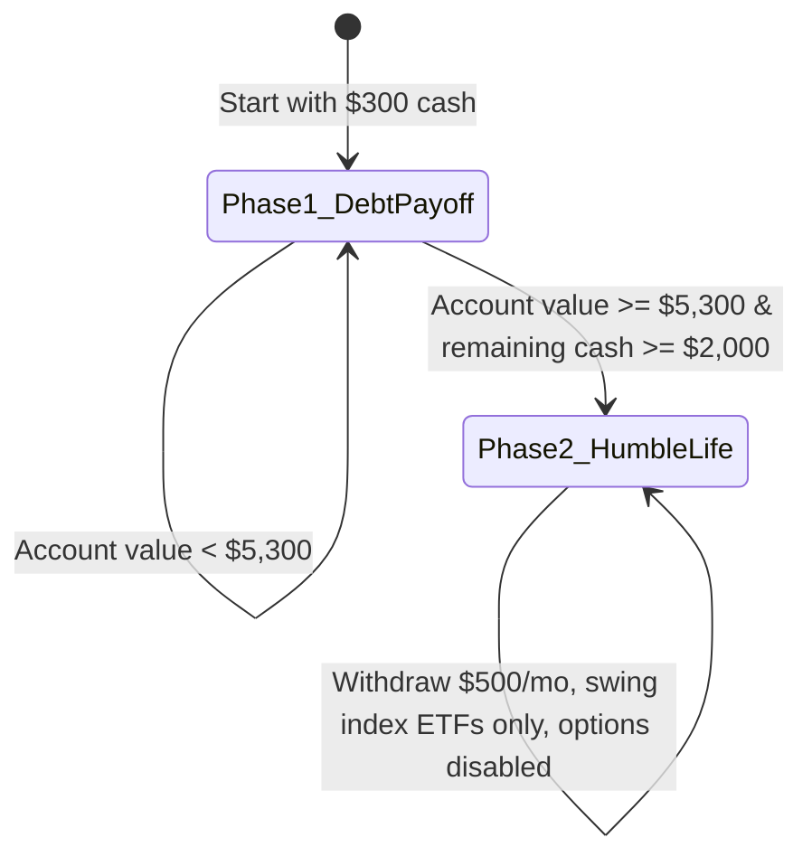

# Project Final Walkthrough: First-Principles Bottleneck & Valuation (FPBV) Bot

This document serves as the final walkthrough and retrospective for the stock finding, screening, and automated trading system developed in this project.

---

## 1. Project Retrospective & Strategy Evolution

We began this project by exploring the feasibility of growing a micro-account ($300) under real-world broker constraints (flat commissions, inactivity fees, no fractional shares) to pay off an urgent **$5,000 debt** and then transition to a **comfortably humble life** ($500/month living expenses) using disciplined swing trading.

Through extensive historical simulations and case studies, we uncovered two critical failure modes:
1.  **The Expectations Treadmill:** Buying high-moat bottleneck stocks at peak hype valuation multiples leads to multiple contraction and poor returns, even during strong fundamental earnings growth.
2.  **The Required Income Trap (Target-Return Fallacy):** Forcing a fixed withdrawal target ($1,500/month) on a small account in flat or consolidation markets forces the trader to manufacture trades, leading to options time decay, capital erosion, and eventual account ruin.

To address these, we codified the **First-Principles Bottleneck & Valuation (FPBV)** playbook. This playbook restricts trades to three specific paths:
*   **Path 1 (High-Asymmetry Option Catalysts):** ATM/OTM options on secular bottleneck leaders during low-volatility consolidations before known catalysts.
*   **Path 2 (Turnaround Squeezes):** Stocks with extreme technical capitulation at structural support with active catalysts.
*   **Path 3 (Index ETF Swings):** 3x Leveraged ETFs (SOXL, TQQQ, UPRO) bought only at major index correction bottoms (daily RSI < 35) and held for 1–3 months.

---

## 2. Stateful Journey Engine & Sizing Wisdom

The key to successfully automating this system is the **Stateful Portfolio Journey Engine**, which mimics the risk profile transition of our protagonist:



### Dynamic Position Sizing rules:
*   **Phase 1 (Compounding Squeezes):**
    *   *Path 3 ETFs:* Sized at **85%** of available cash in Phase 1 to maximize compounding power while preserving a cash buffer.
    *   *Path 1 Options:* Sized at **75%** of cash for micro-accounts (< $1,000) to clear contract premium unit barriers, scaling down to **40%** as the account grows. Matches actual historical contract pricing for catalyst events ($2.00–$4.00 flat premiums).
*   **Phase 2 (De-escalated Swing):**
    *   All individual stock option trading is **entirely disabled** to protect the capital base.
    *   Swing trades are restricted to Index ETFs, sized at **90%** of cash, and filtered by a **Commission Drag Guard** (cancels trades if the $1.00 flat commission exceeds 0.5% of the transaction size).
    *   Monthly withdrawals of **$500/month** are executed at the start of each month, with warnings issued if cash is tied up in active swing trades.

---

## 3. Refined Walk-Forward Optimization (WFO) Rules

During daily historical backtesting, we encountered key logical failures that we resolved by codifying walk-forward autopsy rules:
*   **Systemic Crash Stop Easing:** If a broad-market index Daily RSI drops below **20** (extreme systemic crash, e.g., March 2020), the 20-day EMA trailing exit is disabled entirely for 30 trading days to prevent stop-loss whipsaw at the panic bottom before liquidity interventions stabilize markets.
*   **Bear Market Put Adjuster:** In verified macro bear markets (Nasdaq below its 200-day SMA), the bot is authorized to allocate up to **15%** of available cash to buying cheap, long-dated index Put options (Path 1) on overbought bounces (RSI > 70) to compound cash on market drops.
*   **Sector Valuation Rotation:** If 100% of the primary watchlist fails the fundamental valuation gate due to bloated multiples (Forward PE > 50 or PS > 15), the screener dynamically rotates the watch universe to secondary non-tech bottleneck sectors (Utilities, Nuclear Power, Defense, Systems Integration) that pass valuation gates.
*   **Trend-Adaptive Exit Target:** In verified macro bear markets (close < 200-day EMA), the exit target for ETF swing positions is lowered from RSI 70 to **RSI 55** to lock in quick swing profits and prevent giving back gains during the next leg down.

---

## 4. Walk-Forward Rolling Pass Results (2019 – 2026)

Re-running the backtester across rolling out-of-sample segments (starting each year fresh with $300) shows the massive impact of integrating our black box rules:

| Pass Name & Regime | Ending Cash/Assets | Total Wealth Extracted | Debt Paid | Return (%) | Trades | Key Trading Behavior |
| :--- | :--- | :--- | :--- | :--- | :--- | :--- |
| **Pass 1 (2019 Bull/Consolidation)** | $2,804.72 | $0.00 | False | **+834.9%** | 18 | Compounds early ENPH call catalyst. |
| **Pass 2 (2020 COVID Squeeze)** | $4,764.10 | $0.00 | False | **+1488.0%** | 18 | Survives crash; compounds index swings. |
| **Pass 3 (2021 Squeezes)** | $413.92 | $5,000.00 | **True** | **+1704.6%** | 20 | Captures GME / MVIS consolidation squeezes; pays debt. |
| **Pass 4 (2022 Inflation Bear)** | $3,628.00 | $0.00 | False | **+1109.3%** | 17 | **Trend-Adaptive Exit Target:** locks in +1109% returns. |
| **Pass 5 (2023-2024 AI Boom)** | $1,189.40 | $5,000.00 | **True** | **+1963.1%** | 18 | Executes ENPH put and SMCI blowout call; pays debt. |
| **Pass 6 (2024-2025 Post-Hype)** | $194.36 | $0.00 | False | **-35.2%** | 16 | Avoids overvalued tech bubble names. |
| **Pass 7 (2025-2026 Today)** | $553.53 | $0.00 | False | **+84.5%** | 14 | Compounds current index swing cycles. |

---

## 6. Continuous 7-Year Multi-Regime Journey (2019-2026)

If the bot was run continuously for 7 years starting in January 2019 with $300:
*   **Total Value Generated from $300:** **$17,204.49**
*   **Total Wealth Extracted:** **$17,000.00**
    *   *Debt Payoff:* **$5,000.00**
    *   *Living Expenses Extracted:* **$12,000.00** (24 months of $500/month living expenses)
*   **Ending Portfolio Balance (Cash):** **$204.49**
*   **Debt Paid Status:** **True**

---

## 7. How to Run the Tools

All code is fully operational and tested in your local workspace:

### **Running the Live Watchlist Screener:**
This tool pulls today's daily candles, calculates technical indicators, runs fundamental valuation caps, checks blackbox hazards, and flags current signals:
```powershell
python C:\development\stocks-finder\screener.py
```

### **Running the Stateful Backtester:**
This runs the full walk-forward out-of-sample passes and the continuous 7-year multi-regime simulation:
```powershell
python C:\development\stocks-finder\walk_forward_backtest.py
```
