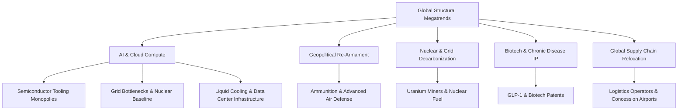

# First-Principles Global Stock Analysis

This document breaks down the core mechanics, structural drivers, and investment catalysts for the 30 high-moat global companies discussed. It analyzes why they rose and synthesizes a "Black Box" of investment lessons.

---

## Part 1: First-Principles Industry Groupings

### Group A: Semiconductor Equipment Monopolies
*The ultimate gatekeepers of high-performance computing.*

#### 1. ASM International N.V. (ASM.AS)
*   **First Principle:** Chips cannot function at atomic scales without uniform chemical layers. Atomic Layer Deposition (ALD) is the only physics-backed way to deposit these materials.
*   **Core Driver:** ASM holds the patents and operational expertise on ALD. As chips transitioned from planar to 3D structures (Gate-All-Around / GAA transistors), ALD steps per wafer skyrocketed.
*   **The Catalyst:** The rush to manufacture 3nm and 2nm chips for AI processors (Nvidia, AMD, Apple) forced foundries to scale ALD purchases.

#### 2. Disco Corporation (6146.T)
*   **First Principle:** Silicon wafers must be ground to microscopic thickness and sliced with extreme precision. Silicon is highly brittle; sub-micron errors destroy the entire yield.
*   **Core Driver:** Disco controls ~80% of the world's precision grinding and dicing saws.
*   **The Catalyst:** High-Bandwidth Memory (HBM) stacking requires grinding DRAM wafers to ultra-thin levels and dicing them into dies for 3D stacking (CoWoS packaging).

#### 3. Tokyo Electron Ltd. (8035.T)
*   **First Principle:** Before lithography prints a circuit, photoresist must be coated onto the silicon wafer with absolute uniformity, and developed afterwards.
*   **Core Driver:** Tokyo Electron holds a near-100% monopoly on coater/developer track systems linked to EUV lithography machines.
*   **The Catalyst:** The exponential scale-up in EUV lithography lines worldwide.

#### 4. Advantest Corp. (6857.T)
*   **First Principle:** AI chips and memory dies contain billions of transistors. You cannot package a chip without testing its electrical connections first, or you risk packaging a dead die (wasting massive capital).
*   **Core Driver:** Advantest dominates high-speed SoC (System-on-Chip) and HBM testing.
*   **The Catalyst:** Extreme testing times required for complex HBM3e/HBM4 stacks and large-scale AI GPUs.

#### 5. Lasertec Corp. (6920.T)
*   **First Principle:** EUV lithography uses mirrors to project light onto photomasks. If there is a single microscopic defect on a mask, it will print that defect onto every single chip on the wafer, destroying millions of dollars of yield.
*   **Core Driver:** Lasertec is the *only* company in the world that makes actinic EUV mask inspection tools.
*   **The Catalyst:** The industry-wide adoption of high-numerical-aperture (High-NA) EUV lithography.

---

### Group B: Defense & Tactical Moats
*Survival is a non-negotiable expense.*

#### 6. Rheinmetall AG (RHM.DE)
*   **First Principle:** In high-intensity land warfare, artillery shells and armored combat vehicles are the core units of attrition. 
*   **Core Driver:** Rheinmetall is the primary European manufacturer of NATO-standard tank ammunition, artillery systems, and infantry fighting vehicles.
*   **The Catalyst:** The war in Ukraine depleted European stockpiles. European nations realized their domestic ammunition reserves would last only days, leading to massive long-term procurement contracts.

#### 7. Saab AB (SAAB-B.ST)
*   **First Principle:** Modern air and naval defense in contested regions requires high-end, independent design capability (submarines, fighters, anti-ship missiles) tailored for electronic warfare environments.
*   **Core Driver:** Saab manufactures the Gripen fighter jets and Visby-class stealth corvettes. 
*   **The Catalyst:** Sweden and Finland joining NATO, forcing immediate integration and scaling of Scandinavian defensive infrastructure.

#### 8. Kongsberg Gruppen (KOG.OL)
*   **First Principle:** Air defense systems and naval strike missiles are highly technical, complex, and require decades of testing.
*   **Core Driver:** Kongsberg produces the NASAMS air defense systems (jointly with RTX) and Naval Strike Missiles (NSM).
*   **The Catalyst:** Global recognition of the vulnerability of airspaces and maritime shipping lanes, creating a multi-decade order book.

#### 9. Leonardo S.p.A. (LDO.MI)
*   **First Principle:** Helicopters, military aircraft, and defense electronics must be integrated into cohesive combat networks.
*   **Core Driver:** Leonardo has a virtual monopoly on Italian military helicopter manufacturing and is a core contractor for European multi-role combat jets (Eurofighter).
*   **The Catalyst:** European joint defense initiatives and radar modernization budgets.

#### 10. BAE Systems PLC (BA.L)
*   **First Principle:** Complex military programs (nuclear submarines, stealth fighters, heavy combat vehicles) require decades of program management and state-of-the-art shipyard and manufacturing infrastructure.
*   **Core Driver:** BAE is Europe's largest defense contractor and the sole builder of the UK's nuclear submarines.
*   **The Catalyst:** The AUKUS treaty (US, UK, Australia submarine agreement) and sustained UK/US defense budget increases.

#### 11. Mitsubishi Heavy Industries (7011.T)
*   **First Principle:** A nation's primary industrial heavy engineer acts as its national champion for defense and power generation.
*   **Core Driver:** MHI is Japan's largest defense contractor, building fighter jets, missiles, and naval vessels, while also manufacturing gas turbines.
*   **The Catalyst:** Japan's historic double-digit increases in defense spending to counter regional threats.

---

### Group C: Grid Infrastructure & Energy Bottlenecks
*Computation is constrained by electricity.*

#### 12. Vistra Corp. (VST)
*   **First Principle:** AI data centers run 24/7 and cannot rely on intermittent solar or wind. They require baseload power.
*   **Core Driver:** Vistra operates a massive fleet of gas-fired power plants and nuclear assets (Comanche Peak) in deregulated markets (Texas).
*   **The Catalyst:** Tech giants offering to pay massive premiums (PPAs) to buy clean, constant power directly from nuclear/gas plants.

#### 13. Constellation Energy (CEG)
*   **First Principle:** Nuclear plants are the only zero-carbon source of continuous, round-the-clock electricity.
*   **Core Driver:** Constellation is the largest operator of commercial nuclear power plants in the US.
*   **The Catalyst:** The historical agreement to supply power from closed nuclear sites directly to tech-company data centers at premium prices.

#### 14. Eaton Corporation PLC (ETN)
*   **First Principle:** You cannot connect a power source to a data center without switchgear, transformers, and power distribution units.
*   **Core Driver:** Eaton dominates the global electrical power management market.
*   **The Catalyst:** Severe global shortages of electrical transformers, with lead times stretching up to 3–4 years.

#### 15. GE Vernova Inc. (GEV)
*   **First Principle:** Gas turbines are the fastest and most reliable way to add dispatchable electrical capacity to a strained grid.
*   **Core Driver:** GE Vernova is the world leader in gas turbine manufacturing and servicing.
*   **The Catalyst:** The grid-capacity crisis forced utilities to rush order new gas turbines to backup solar/wind grids.

#### 16. Powell Industries Inc. (POWL)
*   **First Principle:** Heavy industrial power sites require custom-engineered electrical houses (e-houses) to safely distribute mega-voltage power.
*   **Core Driver:** Powell designs and custom-builds e-houses for chemical plants, LNG facilities, and data centers.
*   **The Catalyst:** The simultaneous build-out of US LNG export terminals and massive AI data centers.

---

### Group D: Data Center Thermal Management
*Silicon melts without active cooling.*

#### 17. Vertiv Holdings Co. (VRT)
*   **First Principle:** As chips consume more power (e.g., Nvidia H100s at 700W, Blackwell at 1200W+), traditional air cooling fails. Heat must be transferred using liquid.
*   **Core Driver:** Vertiv is the leading provider of end-to-end data center cooling, power distribution, and rack systems.
*   **The Catalyst:** The rapid industry transition from air cooling to liquid-to-air heat exchangers and coolant distribution units (CDUs).

#### 18. Modine Manufacturing Co. (MOD)
*   **First Principle:** Industrial heating and cooling coils must be engineered for highly specific airflows and thermal loads.
*   **Core Driver:** Modine manufactures high-efficiency cooling chillers and coil units for data centers.
*   **The Catalyst:** The massive scale of AI data center build-outs requiring large-scale industrial chiller arrays.

---

### Group E: Nuclear Fuel Supply Chain
*Reactors cannot run without uranium.*

#### 19. Cameco Corporation (CCJ)
*   **First Principle:** Nuclear reactors require enriched uranium fuel rods. Uranium cannot be synthetically produced; it must be mined from the earth.
*   **Core Driver:** Cameco owns the world's highest-grade, lowest-cost uranium mines in Saskatchewan.
*   **The Catalyst:** Geopolitical isolation of Russian uranium supply combined with the global nuclear power restart.

#### 20. Kazatomprom (KAP.IL)
*   **First Principle:** In-Situ Recovery (ISR) mining using acid is the cheapest way to extract uranium from sandstone.
*   **Core Driver:** Kazatomprom is the national miner of Kazakhstan, controlling the world's largest low-cost uranium reserves.
*   **The Catalyst:** Structural undersupply in the uranium spot market coupled with supply chain constraints (e.g., sulfuric acid shortages).

#### 21. NexGen Energy Ltd. (NXE)
*   **First Principle:** A world-class uranium mine takes 10–15 years to discover, permit, and build.
*   **Core Driver:** NexGen owns the "Arrow" deposit, the largest undeveloped ultra-high-grade uranium asset.
*   **The Catalyst:** Financial markets pricing in the future value of the asset as the uranium market enters structural deficit.

#### 22. BWX Technologies Inc. (BWXT)
*   **First Principle:** Nuclear materials require strict military-grade security clearances, regulatory permits, and specialized metallurgical fabrication facilities.
*   **Core Driver:** BWXT is the sole supplier of nuclear reactors and fuel to the US Navy (aircraft carriers and submarines).
*   **The Catalyst:** Increased naval shipbuilding budgets and commercial contracts to build small modular reactors (SMRs).

---

### Group F: Aviation, Transport & Concessions
*Physical assets and networks that cannot be duplicated.*

#### 23. Rolls-Royce Holdings PLC (RR.L)
*   **First Principle:** Designing widebody aircraft engines requires tens of billions of dollars in R&D and decades of testing. No new competitor can enter this space.
*   **Core Driver:** Rolls-Royce operates on a "Power-by-the-Hour" business model—selling engines at low margins but locking in highly profitable 20-year service contracts.
*   **The Catalyst:** Post-COVID resumption of long-haul international flights, which triggered massive engine flight hour payments.

#### 24. Safran SA (SAF.PA)
*   **First Principle:** Every commercial narrowbody aircraft (Boeing 737, Airbus A320) relies on engines manufactured by a tiny duopoly (CFM International - Safran/GE, and Pratt & Whitney).
*   **Core Driver:** Safran is the French partner in CFM International, capturing the highly lucrative aftermarket spare parts revenue.
*   **The Catalyst:** The global aviation capacity crunch, forcing airlines to fly older planes longer, which requires massive spare parts and servicing.

#### 25. Grupo Aeroportuario del Pacífico (PAC)
*   **First Principle:** An airport is a localized geographic monopoly. If you want to fly into Guadalajara or Los Cabos, you *must* use PAC’s runway.
*   **Core Driver:** PAC holds long-term government concessions to run key airports in Mexico. They collect a fee (TUA) from every single passenger.
*   **The Catalyst:** Nearshoring trends shifting manufacturing from China to Mexico, driving business travel, combined with resilient leisure travel.

#### 26. DSV A/S (DSV.CO)
*   **First Principle:** Moving goods globally requires coordinating ships, planes, trucks, customs, and warehouses. Doing this yourself is too complex.
*   **Core Driver:** DSV is a global freight forwarder. They do not own ships or planes (asset-light); instead, they buy bulk capacity and resell it to companies, managing the complexity.
*   **The Catalyst:** Geopolitical supply chain disruptions (Red Sea, canal delays) which increased shipping rates and complexity, allowing freight forwarders to extract higher margins.

---

### Group G: Biotech Patent Monopolies
*The ultimate pricing power: life-saving intellectual property.*

#### 27. Novo Nordisk A/S (NVO)
*   **First Principle:** Obese and diabetic patients have a hormonal imbalance. Mimicking the GLP-1 hormone regulates appetite and blood sugar.
*   **Core Driver:** Novo Nordisk holds the patents and manufacturing capabilities for semaglutide (Ozempic/Wegovy).
*   **The Catalyst:** Clinical proof that Wegovy reduces cardiovascular events (strokes, heart attacks) by 20%, unlocking insurance coverage for a market of over 1 billion potential users.

#### 28. Eli Lilly & Co. (LLY)
*   **First Principle:** Stimulating both GLP-1 and GIP receptors (dual agonists) yields even greater weight loss results than single GLP-1 drugs.
*   **Core Driver:** Eli Lilly holds the patents for tirzepatide (Mounjaro/Zepbound).
*   **The Catalyst:** Clinical trials showing weight loss of over 20-22%, making it the most effective weight loss therapeutic in history.

#### 29. Vertex Pharmaceuticals Inc. (VRTX)
*   **First Principle:** Cystic Fibrosis is caused by a genetic mutation in the CFTR protein. If you develop a molecule that corrects this protein, you can cure the symptoms of the disease.
*   **Core Driver:** Vertex holds a virtual 100% global monopoly on CFTR modulators.
*   **The Catalyst:** The launch of Trikafta, which treats 90% of CF patients, giving Vertex a captive, high-pricing-power market.

---

### Group H: Industrial Compounders
*Inflation-indexed infrastructure.*

#### 30. L'Air Liquide S.A. (AI.PA)
*   **First Principle:** Industrial gases (oxygen, nitrogen, hydrogen) are heavy and expensive to transport over long distances.
*   **Core Driver:** Air Liquide builds gas generation plants directly adjacent to customers' steel/chemical factories, connected by direct pipelines under 15-20 year take-or-pay contracts.
*   **The Catalyst:** High inflation, which triggered contract indexation clauses, allowing Air Liquide to pass through energy cost spikes to clients while maintaining stable margins.

---

## Part 2: The "Black Box" of Investment Lessons

Analyzing these 30 stories reveals several recurring structural patterns, detection gaps, and investment principles.

### The Five "Black Box" Investment Rules

#### Rule 1: The Bottleneck is Better Than the Brand
*   *Lesson:* Don't invest in the flashy end-product (like the AI model, the EV maker, or the tech brand). Invest in the un-bypassable physical bottleneck.
*   *Evidence:* While chip developers competed fiercely, **Disco Corp** (~80% of wafer dicing saws) and **Lasertec** (100% of EUV mask inspection) made massive, risk-free profits regardless of which chip developer won.

#### Rule 2: The Power of Regulated & Natural Monopolies
*   *Lesson:* The best businesses are geographical or regulatory monopolies where entering the market is physically or legally impossible.
*   *Evidence:* **Airports (PAC)**, **Nuclear Operators (CEG)**, and **Defense shipyards (BAE)** cannot be duplicated. They face no new startups.

#### Rule 3: Look for Secondary Effects of Megatrends
*   *Lesson:* The primary effect of a megatrend (e.g., AI compute) is often priced in quickly. The secondary effect (the need for electricity, liquid cooling, grid transformers, and uranium to run those chips) is initially underpriced by the market.
*   *Evidence:* **Vistra (VST)**, **Eaton (ETN)**, and **Cameco (CCJ)** skyrocketed because the market did not immediately calculate the physical power requirements of the tech expansion.

#### Rule 4: Pay-to-Play vs. Asset-Light
*   *Lesson:* Look for companies that have high operational leverage. When demand rises, their revenue should scale exponentially while their capital expenditure scales linearly.
*   *Evidence:* **Rolls-Royce (RR.L)** earns money on flight hours (asset-light service model) once the massive capital expenditure of building the engine is completed.

#### Rule 5: Value of Long-Term Patents
*   *Lesson:* A pharmaceutical patent is a government-enforced monopoly. When it targets a massive addressable market (e.g., obesity), the growth is bounded only by manufacturing capacity.
*   *Evidence:* **Novo Nordisk (NVO)** and **Eli Lilly (LLY)**.

---

### Synthesis: The Investment Black Box Matrix

| Industry / Theme | Key Bottleneck | Core Risk / Blocker | Why It Doubled |
| --- | --- | --- | --- |
| **AI Hardware** | Precision Dicing / Metrology | Foundry CapEx cuts | Extreme HBM/Packaging density demands |
| **Grid Capacity** | Grid Transformers / Nuclear Power | Regulatory hurdles | AI Data Centers exceeding municipal grid capacity |
| **Defense** | Ammunition capacity / Electronics | Government budget cuts | Sudden depletion of national stockpiles |
| **Biotech** | Molecular patents / Scaling capacity | Patent expiration (generic entry) | Unlocking trillion-dollar market size (Obesity) |
| **Logistics / Airports**| Concession rights / Network nodes | Global trade collapse | Nearshoring infrastructure concentration |
