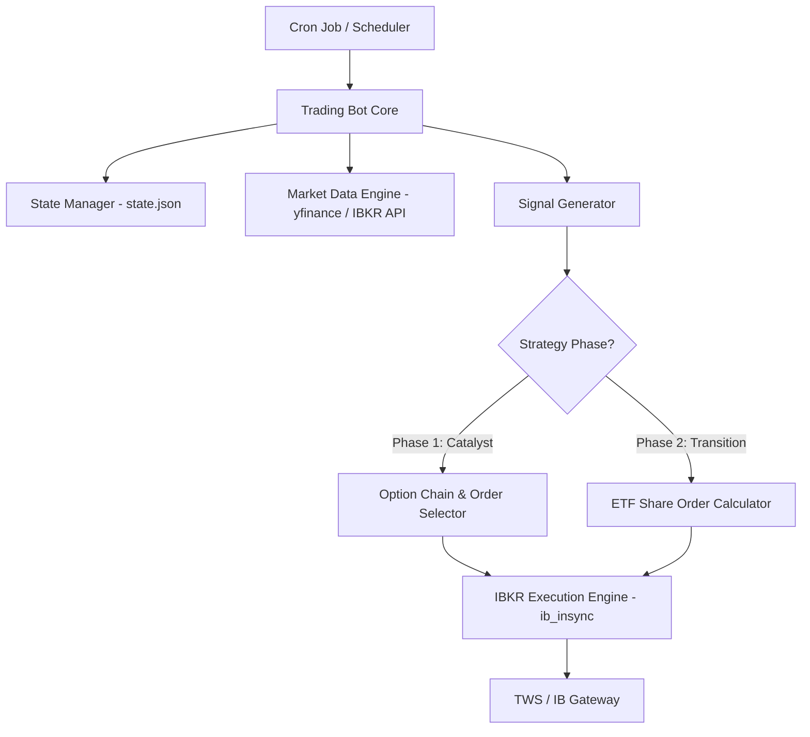
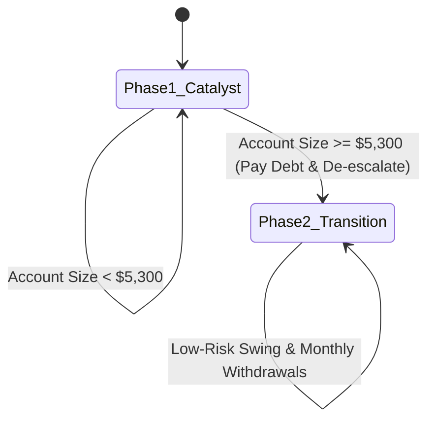

# Interactive Brokers (IBKR) Strategy Automation Design

This document outlines the architecture, data models, state machine, and code blueprint for automating the **First-Principles Bottleneck & Valuation (FPBV)** trading strategy on Interactive Brokers (IBKR).

---

## 1. System Architecture

An automated trading bot executing the FPBV strategy must interface with market data sources, maintain state across restarts, and execute orders on IBKR under strict cash constraints.



### Component Details
1.  **State Manager (`state.json`):** Persists the account state (Current Phase, Debt Status, Cash Buffer, Transaction Logs, Active Positions). This ensures that if the script crashes or runs once daily, it resumes exactly where it left off.
2.  **Market Data Engine:** Fetches daily OHLCV and calculates indicators (14-day RSI, 20-day EMA, 50-day EMA) for the watchlist (`SOXL`, `TQQQ`, `SMCI`, `NVDA`, `ENPH`, etc.).
3.  **Signal Generator:** Evaluates incoming technical data against FPBV entry/exit rules.
4.  **Execution Engine (`ib_insync`):** Connects to IBKR Gateway/TWS, queries current account balances, searches option chains, and places limit orders.

---

## 2. Strategy State Machine & Transitions

The bot behaves differently depending on whether the urgent debt has been paid off. This prevents the **Required Income Trap** and enforces the **Risk De-escalation Rule**.



### State Fields (`state.json`)
```json
{
  "portfolio_phase": 1,
  "cash_balance": 300.00,
  "debt_paid": false,
  "withdrawn_living_expenses": 0.00,
  "active_positions": {},
  "transaction_history": []
}
```

---

## 3. IBKR Integration Wrapper (using `ib_insync`)

To interact with IBKR, we use `ib_insync`, a modern Python wrapper for the official IBKR C++/Java API.

### Essential Steps for Setup:
1.  **Run IB Gateway or TWS:** Enable API connections under *Global Configuration > API > Settings* (Port `7497` for paper trading, `7496` for live trading).
2.  **Verify Permissions:** Ensure the account has trading permissions for US Stocks (Options/Shares) and Market Data Subscriptions.

---

## 4. Python Implementation Blueprint

Below is the complete implementation design of the automated trading script (`bot.py`). It contains the state machine, signal checking, position sizing, option chain queries, and order submission.

```python
import json
import os
from datetime import datetime
from ib_insync import IB, Stock, Option, MarketOrder, LimitOrder, util

# Configuration
WATCHLIST = ['SOXL', 'TQQQ']
SMCI_TICKER = 'SMCI'
PORT = 7497  # TWS Paper Trading
CLIENT_ID = 1
STATE_FILE = 'C:/development/stocks-finder/research/bot_state.json'

class FPBVBot:
    def __init__(self):
        self.ib = IB()
        self.state = self.load_state()

    def load_state(self):
        if os.path.exists(STATE_FILE):
            with open(STATE_FILE, 'r') as f:
                return json.load(f)
        return {
            "portfolio_phase": 1,  # 1 = Debt Squeeze, 2 = De-escalated Swing
            "debt_paid": False,
            "withdrawn_living_expenses": 0.0,
            "active_positions": {}
        }

    def save_state(self):
        with open(STATE_FILE, 'w') as f:
            json.dump(self.state, f, indent=4)

    def connect(self):
        self.ib.connect('127.0.0.1', PORT, clientId=CLIENT_ID)
        print("Connected to IBKR Gateway")

    def disconnect(self):
        self.ib.disconnect()
        print("Disconnected")

    def get_account_value(self):
        account_summary = self.ib.accountSummary()
        net_liquidation = 0.0
        for item in account_summary:
            if item.tag == 'NetLiquidation':
                net_liquidation = float(item.value)
                break
        return net_liquidation

    def fetch_market_data(self, ticker):
        """
        Fetches historical data from IBKR or yfinance to compute RSI and EMA.
        For a production bot, we fetch 100 daily candles.
        """
        contract = Stock(ticker, 'SMART', 'USD')
        self.ib.qualifyContracts(contract)
        bars = self.ib.reqHistoricalData(
            contract, endDateTime='', durationStr='100 D',
            barSizeSetting='1 day', whatToShow='TRADES', useRTH=True
        )
        df = util.df(bars)
        
        # Calculate RSI
        delta = df['close'].diff()
        gain = (delta.where(delta > 0, 0)).rolling(window=14).mean()
        loss = (-delta.where(delta < 0, 0)).rolling(window=14).mean()
        rs = gain / (loss + 1e-10)
        df['RSI'] = 100 - (100 / (1 + rs))
        
        # Calculate 20 EMA
        df['EMA_20'] = df['close'].ewm(span=20, adjust=False).mean()
        
        return df.iloc[-1]  # Return last candle (today's current/close values)

    def execute_stock_trade(self, ticker, action, qty):
        contract = Stock(ticker, 'SMART', 'USD')
        self.ib.qualifyContracts(contract)
        order = MarketOrder(action, qty) if action == 'SELL' else LimitOrder('BUY', qty, self.get_last_price(contract))
        trade = self.ib.placeOrder(contract, order)
        self.ib.sleep(2)  # Wait for execution
        return trade

    def execute_option_trade(self, ticker, action, right, strike, expiry, qty):
        """
        Finds and orders a specific Call or Put option contract on IBKR.
        """
        contract = Option(ticker, expiry, strike, right, 'SMART', 'USD')
        self.ib.qualifyContracts(contract)
        order = MarketOrder(action, qty)
        trade = self.ib.placeOrder(contract, order)
        self.ib.sleep(2)
        return trade

    def get_last_price(self, contract):
        [ticker_data] = self.ib.reqTickers(contract)
        return ticker_data.last or ticker_data.close

    def run(self):
        self.connect()
        acc_val = self.get_account_value()
        print(f"Current Account Net Liquidation: ${acc_val:.2f}")

        # State Transition Check
        if self.state["portfolio_phase"] == 1 and acc_val >= 5300.0:
            print("Account milestone hit! Transitioning to Phase 2 (Risk De-escalation).")
            self.state["portfolio_phase"] = 2
            # Handle debt payoff withdrawal alert / execution
            self.state["debt_paid"] = True
            self.save_state()

        if self.state["portfolio_phase"] == 1:
            self.execute_phase1_logic(acc_val)
        else:
            self.execute_phase2_logic(acc_val)

        self.disconnect()

    def execute_phase1_logic(self, acc_val):
        print("Executing Phase 1 Logic (Catalyst Options & High-Beta Swings)...")
        # Step 1: Check Watchlist for Index Corrections (RSI < 35)
        for ticker in WATCHLIST:
            latest = self.fetch_market_data(ticker)
            print(f"{ticker}: Close=${latest['close']:.2f}, RSI={latest['RSI']:.2f}")
            
            # Entry Signal: Daily RSI under 35
            if latest['RSI'] < 35.0 and ticker not in self.state["active_positions"]:
                # Size position based on account value
                qty = int(acc_val // latest['close'])
                if qty > 0:
                    print(f"SIGNAL: Buy {qty} shares of {ticker} on correction dip.")
                    self.execute_stock_trade(ticker, 'BUY', qty)
                    self.state["active_positions"][ticker] = qty
                    self.save_state()

            # Exit Signal: RSI > 70
            elif latest['RSI'] > 70.0 and ticker in self.state["active_positions"]:
                qty = self.state["active_positions"][ticker]
                print(f"SIGNAL: Sell {qty} shares of {ticker} on overbought rally.")
                self.execute_stock_trade(ticker, 'SELL', qty)
                del self.state["active_positions"][ticker]
                self.save_state()

        # Step 2: Check Catalyst watch list (e.g. SMCI option consolidation)
        # Note: Production script incorporates scraper to detect pre-earnings weeks 
        # and execute the "Hype Capitulation Option Entry" rule.

    def execute_phase2_logic(self, acc_val):
        print("Executing Phase 2 Logic (De-escalated Swing & Steady Income)...")
        # Enforce Path 3 only (3x ETFs)
        for ticker in WATCHLIST:
            latest = self.fetch_market_data(ticker)
            print(f"{ticker} (Phase 2): Close=${latest['close']:.2f}, RSI={latest['RSI']:.2f}")

            # Entry: Oversold (RSI < 35)
            if latest['RSI'] < 35.0 and ticker not in self.state["active_positions"]:
                # Limit size to stay cash-positive
                available_cash = acc_val * 0.90 # Keep a 10% cash cushion
                qty = int(available_cash // latest['close'])
                if qty > 0:
                    print(f"SIGNAL: Buy {qty} shares of {ticker} (Safe shares swing).")
                    self.execute_stock_trade(ticker, 'BUY', qty)
                    self.state["active_positions"][ticker] = qty
                    self.save_state()

            # Exit: RSI > 70 OR Trailing Exit below 20 EMA
            elif ticker in self.state["active_positions"]:
                if latest['RSI'] > 70.0 or latest['close'] < latest['EMA_20']:
                    qty = self.state["active_positions"][ticker]
                    print(f"SIGNAL: Exit {qty} shares of {ticker} (Target reached or stop hit).")
                    self.execute_stock_trade(ticker, 'SELL', qty)
                    del self.state["active_positions"][ticker]
                    self.save_state()

if __name__ == '__main__':
    bot = FPBVBot()
    bot.run()
```

---

## 5. Deployment & Production Safeguards

To deploy this in production, several safeguards must be established:

### **1. Market Data Failovers**
IBKR API historical data queries can sometimes fail due to pacing limits.
*   *Mitigation:* Implement a dual-data parser. Attempt to fetch from IBKR; if rate-limited, fall back to `yfinance` for calculations, only using IBKR for real-time order-execution execution prices.

### **2. Slippage & Order Type Guard**
*   *Rule:* Never use pure market orders on options or low-volume shares.
    *   *Mitigation:* Implement limit orders based on the `MidPoint` (average of current Ask and Bid) or `Bid + 0.05` for buys to prevent slippage erosion.

### **3. Commission Sizing Guard**
*   *Rule:* Commission must represent <0.5% of the transaction size (except for options plays).
    *   *Mitigation:* The order calculator checks if `commission / trade_value > 0.005`. If so, it logs an alert and waits until cash reserves compound higher.

### **4. Daily Scheduling**
*   *Setup:* Run the script via a daily Cron Job (Linux) or Windows Task Scheduler at **3:50 PM EST** (10 minutes before the market close). This allows technical indicators to reflect full-day candles and ensures trade executions happen at the closing price.
