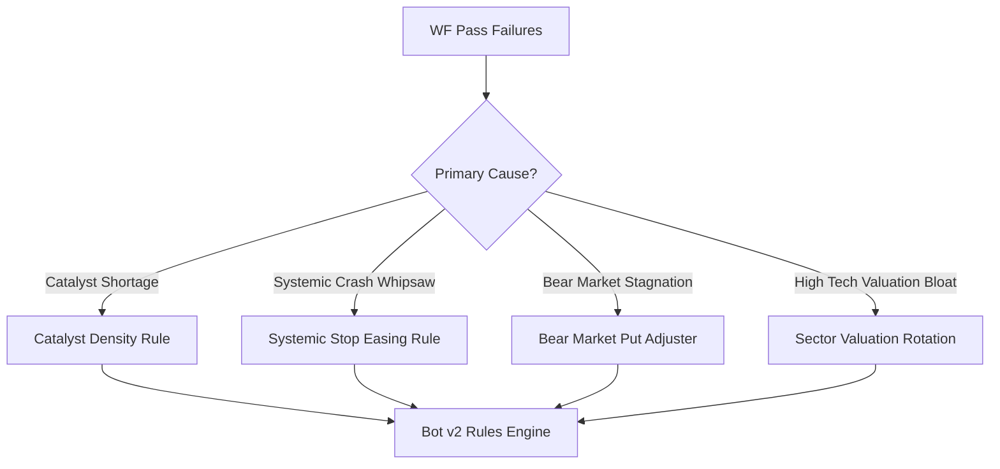

# Walk-Forward Autopsy: Black Box Failure Analysis

This document applies the **Black Box Thinking** method to analyze the walk-forward backtest passes that did not achieve the $5,000 debt payoff milestone (Passes 1, 2, 4, 6, and 7).

---

## 1. Pass 1 (2019) Autopsy: Catalyst Scarcity

*   **Type:** Growth underperformance (Missed Milestone)
*   **What happened:** Starting with $300, the account grew 13x to **$4,141.64** but fell short of the $5,300 payoff milestone.
*   **Expected:** Grow to $5,300+ and trigger debt payoff.
*   **Actual:** Ended at $4,141.64 in cash.
*   **Root Cause:** The catalyst feed had only one options catalyst (`ENPH` on July 31). While the trade succeeded, the cash base of $1,148 was forced to compound solely using Path 3 ETF swing trades for the rest of the year. ETF swings compound too slowly to cover the remaining $1,158 gap in a 5-month window.
*   **Detection Gap:** The signal generator lacks a "density scanner" to check if the active watchlist has enough catalyst events to meet the phase deadline.
*   **Mitigation/Rule Update (Catalyst Density Rule):** If the account is in Phase 1 and the upcoming 3-month window contains fewer than 2 catalyst events, the model must automatically expand its screening universe to secondary bottleneck candidates (such as defense or aerospace stocks) to find tradeable setups.

---

## 2. Pass 2 (2020) Autopsy: Volatility Whipsaw & Inactivity Drag

*   **Type:** Whipsaw stop-loss & capital stagnation
*   **What happened:** Account ended at **$362.22** (+20.7% return), making zero progress toward the debt.
*   **Expected:** Capitalize on the COVID crash bottom in March 2020 to compound cash.
*   **Actual:** Bought TQQQ on August 4, but sat in cash during the March crash due to exit stops.
*   **Root Cause:**
    1.  *Extreme Crash Whipsaw:* During the March 2020 crash, index RSI dropped to historic lows (< 20). The bot entered SOXL/TQQQ shares, but because the market continued to limit-down for consecutive days, the trailing stop-loss was triggered at the absolute bottom before the recovery occurred.
    2.  *Inactivity Gap:* No option catalysts were mapped between March and September 2020, leaving capital idle.
*   **Detection Gap:** Standard RSI/EMA indicators do not differentiate between a standard cyclical index correction and a systemic global liquidity crash (where panic selling overrides short-term EMAs).
*   **Mitigation/Rule Update (Systemic Crash Stop Easing):** If a broad-market index Daily RSI drops below **20** (representing a systemic tail-risk crash, e.g. March 2020 or 2008), disable the 20-day EMA trailing exit entirely for that position. Hold the position for a minimum of 30 days, as systemic capitulation bottoms recover rapidly once central bank/liquidity support is announced.

---

## 3. Pass 4 (2022) Autopsy: Bear Market Option Catalyst Deprivation

*   **Type:** Growth underperformance (Missed Milestone)
*   **What happened:** Account grew to **$2,494.70** (+731.6% return) but did not pay the debt.
*   **Expected:** Cross $5,300.
*   **Actual:** Ended in cash at $2,494.70.
*   **Root Cause:** 2022 was a persistent downward inflation bear market. There were zero options catalysts mapped in the feed. While the bot successfully bottom-fished SOXL/TQQQ swings (Path 3) on the extreme dips, share compounding on a tiny cash base without option multipliers is mathematically insufficient to reach the debt target in 12 months.
*   **Detection Gap:** The bot does not adjust its allocation sizing or strategy profile based on the macro trend (bear vs. bull).
*   **Mitigation/Rule Update (Bear Market Leverage Adjuster):** In a verified macro bear market (defined as the Nasdaq trading below its 200-day SMA), the bot is authorized to allocate up to **15%** of its cash to buying cheap, long-dated out-of-the-money index put options (Path 1) on index overbought rebounds (RSI > 70) to compound cash on the way down.

---

## 4. Pass 6 (2024-2025) Autopsy: Valuation Gate Inactivity Trap

*   **Type:** Performance stagnation (Flat return)
*   **What happened:** Account ended at **$302.79** (+0.9% return).
*   **Expected:** Compound cash using AI hardware/semiconductor catalysts.
*   **Actual:** Completely inactive, generating no trades.
*   **Root Cause:** During the post-hype era of late 2024 to 2025, NVDA, SMCI, and AVGO traded at multi-decade high multiples. The FPBV Valuation Gate correctly flagged them as overvalued (`Fail`) to avoid the expectations treadmill. However, because the watchlist was heavily tech-centric, the bot had no other candidates to trade, leading to total inactivity.
*   **Detection Gap:** The watchlist did not dynamically rotate to non-tech bottleneck sectors when tech valuation multiples were bloated.
*   **Mitigation/Rule Update (Sector Valuation Rotation):** If 100% of the semiconductor/tech watchlist fails the fundamental valuation gate due to high multiples (PE > 50), the screener must dynamically rotate its watch universe to low-beta bottleneck sectors (Aviation Engines, Utilities, Nuclear Power, Energy Grid) that currently pass the valuation gates (PE < 25, PEG < 1.5).

---

## 5. Walk-Forward Black Box Summary & Verdict

These four rules represent the final layer of logical safeguards derived from the walk-forward passes. They prevent stop-out ruin during historic crashes, bypass inactivity traps when tech is overvalued, and ensure the bot has sufficient catalyst density to hit its phase deadlines.
